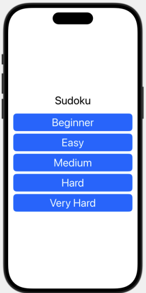
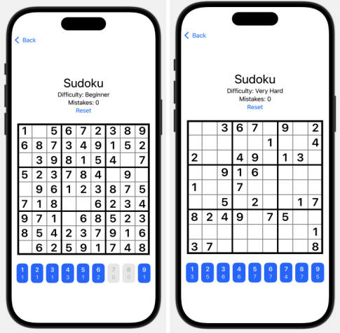
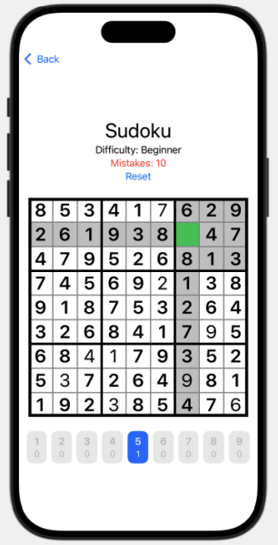
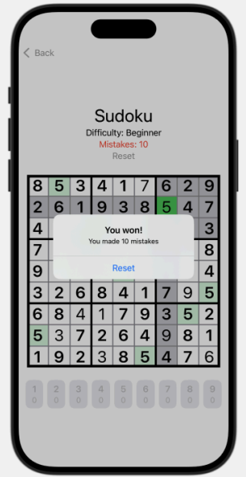

## Sudoku - Swift (MVVM)

There are 2 screens: Menu and Game

### Menu Screen - selecting difficulty

### Game Screen

- Selecting harder difficulty results in less initially revealed cells

- During gameplay cells are highlighted to increase readability

- After completing sudoku dialog appears

